# Two-Phase LinkedIn Scraping Architecture

## Overview

Replace the current single-phase Serper-only scraping with a two-phase pipeline:

**Phase 1 — Serper Discovery** (current implementation, enhanced)
**Phase 2 — LinkedIn Detail Enrichment** (new, using authenticated session)

```mermaid
flowchart LR
    A[User clicks Search/Preset] --> B[Phase 1: Serper Google Search]
    B --> C[Extract basic info from snippets<br/>name, title, company, location]
    C --> D[Save to leads table via UPSERT<br/>status: `scraped`]
    D --> E[Phase 2: LinkedIn Detail Scraper]
    E --> F[Visit each profile URL<br/>with authenticated session]
    F --> G[Extract full details<br/>skills, education, experience, etc.]
    G --> H[Update lead record<br/>status: `profiled`]
    H --> I[Return enriched data to frontend]
```



---

## Phase 1 — Serper Discovery (Already Built)

**File:** [`backend/app/scrapers/linkedin.py`](backend/app/scrapers/linkedin.py)

No major changes needed. The stream endpoint [`POST /api/scraper/linkedin/stream`](backend/app/api/routes/scraper.py:20) already:
- Searches Google via Serper API
- Parses LinkedIn profile data from search snippets
- Saves to DB via `save_linkedin_profiles()`

**Small enhancement:** After saving, emit a `phase_done` event so the frontend knows Phase 1 is complete and Phase 2 is starting.

---

## Phase 2 — LinkedIn Detail Scraper (New)

### Authentication: Session Cookie via `li_at`

LinkedIn uses the `li_at` cookie for session authentication. When a user is logged into LinkedIn, this cookie is present in the browser.

**Setup:**
1. User extracts `li_at` cookie from their LinkedIn session (via browser DevTools)
2. Cookie stored in `.env` as `LINKEDIN_LI_AT` or via Settings page in the app
3. All Phase 2 requests include this cookie in headers

**Extraction instructions for user:**
1. Log into linkedin.com in Chrome
2. Open DevTools (F12) → Application → Cookies → linkedin.com
3. Copy the value of the `li_at` cookie
4. Paste into the app's Settings page or `.env` file

### Profile Data Extraction

Create a new scraper module: [`backend/app/scrapers/linkedin_detail.py`](backend/app/scrapers/linkedin_detail.py)

**Two extraction strategies (tried in order):**

**Strategy A — LinkedIn Internal API (preferred, fastest)**
LinkedIn's web UI calls internal REST APIs that return JSON. When authenticated, these endpoints return full profile data:

```
GET https://www.linkedin.com/voyager/api/identity/profiles/{profile_urn}/profileView

Headers:
  Cookie: li_at={session_cookie}
  Csrf-Token: {csrf_token}
```

The response contains structured JSON with skills, education, experience, certifications, etc.

**Strategy B — HTML Parsing (fallback)**
If the API approach is blocked, parse the public profile HTML page:

```
GET https://www.linkedin.com/in/{username}/

Headers:
  Cookie: li_at={session_cookie}
```

Parse with BeautifulSoup or regex to extract:
- Skills section
- Education section
- Experience section
- About/Summary section

### Data Extracted

| Field | Source | Example |
|-------|--------|---------|
| `skills` | Phase 2 | ["Python", "Machine Learning", "TensorFlow", "Docker", "Kubernetes"] |
| `education` | Phase 2 | [{"institution": "Universitas Indonesia", "degree": "S.Kom", "field": "Computer Science", "start_year": 2016, "end_year": 2020}] |
| `experience` | Phase 2 | [{"company": "Gojek", "title": "Software Engineer", "start_date": "2021", "end_date": "Present", "description": "..."}] |
| `headline` | Phase 2 | "Senior Software Engineer at Gojek | Ex-Tokopedia" |
| `summary` | Phase 2 | Full about section text |
| `certifications` | Phase 2 | [{"name": "AWS Solutions Architect", "issuer": "Amazon"}] |

### Rate Limiting

LinkedIn aggressively rate-limits automated requests. To avoid blocks:

```
For each profile:
  1. Send request
  2. Wait 3-5 seconds (randomized)
  3. If 429/999 status → exponential backoff (wait 30s, 60s, 120s...)
  4. If still blocked → skip remaining profiles, report error
```

---

## Integration Points

### Backend

| File | Change |
|------|--------|
| [`backend/app/scrapers/linkedin_detail.py`](backend/app/scrapers/linkedin_detail.py) | **New file** — Phase 2 scraper |
| [`backend/app/scrapers/__init__.py`](backend/app/scrapers/__init__.py) | Export new scraper |
| [`backend/app/scrapers/linkedin.py`](backend/app/scrapers/linkedin.py) | Add `phase_done` event after `saved` event in stream |
| [`backend/app/api/routes/scraper.py`](backend/app/api/routes/scraper.py) | Add new endpoint [`POST /api/scraper/linkedin/enrich`](backend/app/api/routes/scraper.py) and modify stream to chain Phase 2 |
| [`backend/app/core/config.py`](backend/app/core/config.py:4) | Add `LINKEDIN_LI_AT` setting |
| [`backend/.env`](backend/.env) | Add `LINKEDIN_LI_AT=` line |

### Frontend

| File | Change |
|------|--------|
| [`frontend/src/pages/LinkedInSourcingPage.jsx`](frontend/src/pages/LinkedInSourcingPage.jsx) | Show two-phase progress in scrape modal + inline status |
| [`frontend/src/pages/SettingsPage.jsx`](frontend/src/pages/SettingsPage.jsx) | Add LinkedIn cookie input field |
| [`frontend/src/pages/LeadDetailPage.jsx`](frontend/src/pages/LeadDetailPage.jsx) | Add "Enrich Details" button for leads with only Phase 1 data |

---

## Streaming Events

The SSE stream from [`POST /api/scraper/linkedin/stream`](backend/app/api/routes/scraper.py:20) will emit these additional events:

```javascript
// Phase 1 discovery results (2-5 per query)
{ type: "profile", ... }

// Phase 1 done
{ type: "phase_1_done", profiles_found: 30 }

// Phase 2 starting
{ type: "phase_2_start", total_profiles: 30 }

// Phase 2 progress (1 per profile scraped)
{ type: "enrich", profile_url: "...", 
  enriched: { skills: [...], education: [...], ... },
  progress: { current: 5, total: 30 } }

// Phase 2 error for a single profile (non-fatal)
{ type: "enrich_error", profile_url: "...", error: "Rate limited", 
  progress: { current: 5, total: 30 } }

// All done
{ type: "done", total_saved: 30, total_enriched: 28, 
  total_failed: 2, total_profiles: 30 }
```

---

## Frontend Progress Display

Update [`LinkedInSourcingPage.jsx`](frontend/src/pages/LinkedInSourcingPage.jsx) to show:

```
┌─────────────────────────────────────────────┐
│  🔍 Phase 1: Discovering profiles...       │
│  ━━━━━━━━━━━━━━━━━━━━━━░░░░░░ 15/30        │
│                                             │
│  ⚡ Phase 2: Enriching profile details...   │
│  ━━━━░░░░░░░░░░░░░░░░░░░░░░  4/15          │
│  👤 Bagja Kurniawan ✅ (skills: 9)         │
│  👤 Aldi Fahrezi   ⏳ scraping...          │
│  👤 Ricky Putra    ❌ rate limited          │
└─────────────────────────────────────────────┘
```

---

## Implementation Order

### Step 1: Add `LINKEDIN_LI_AT` config
- Add to [`backend/app/core/config.py`](backend/app/core/config.py:4)
- Add to [`backend/.env`](backend/.env)

### Step 2: Create Phase 2 scraper module
- Create [`backend/app/scrapers/linkedin_detail.py`](backend/app/scrapers/linkedin_detail.py)
- Implement cookie-based request to LinkedIn internal API
- Parse JSON response for skills, education, experience, headline, summary
- Implement rate limiting and error handling

### Step 3: Modify streaming endpoint
- Update [`backend/app/api/routes/scraper.py:20`](backend/app/api/routes/scraper.py:20) to chain Phase 2 after Phase 1
- Add phase events to stream

### Step 4: Update frontend
- Update [`LinkedInSourcingPage.jsx`](frontend/src/pages/LinkedInSourcingPage.jsx) for two-phase progress
- Add "Enrich Details" button to [`LeadDetailPage.jsx`](frontend/src/pages/LeadDetailPage.jsx)
- Add LinkedIn cookie input to [`SettingsPage.jsx`](frontend/src/pages/SettingsPage.jsx)

### Step 5: Batch enrichment endpoint
- Add [`POST /api/scraper/linkedin/enrich`](backend/app/api/routes/scraper.py) for re-enriching existing leads

---

## Risk Mitigation

| Risk | Mitigation |
|------|------------|
| LinkedIn blocks the session cookie | Implement exponential backoff + fallback to HTML parsing |
| LinkedIn changes their API structure | Keep the HTML parsing fallback as Strategy B |
| Rate limiting on many profiles | Add configurable delay between requests |
| User's session expires | Detect expired session (redirect to login page) and report error |
| Legal/ToS concerns | This is for educational/recruitment purposes. Recommend using a dedicated scraping account rather than personal account. |
