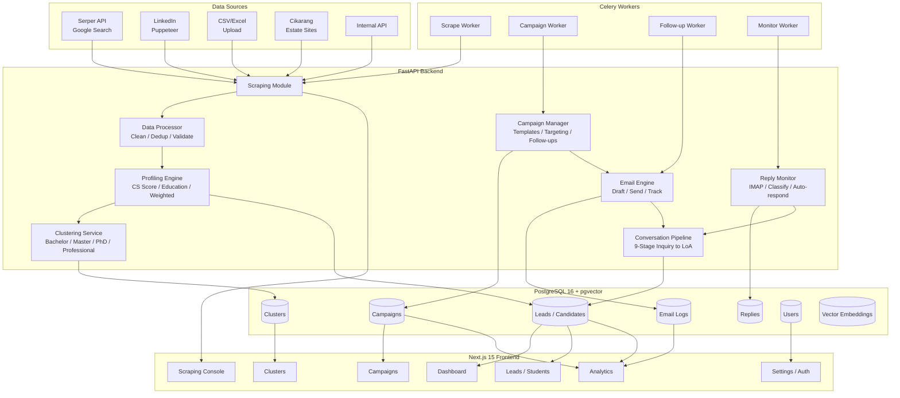

# Unified Student Recruitment System — Feature Comparison & Migration Plan

## 1. Executive Summary

This document compares **7 project versions** across the workspace and recommends a unified architecture for a student recruitment system that covers the full pipeline:

> **Online Scraping → Student Profiling (Bachelor/Master) → Email Follow-up → LoA Issuance**

The recommended target architecture is the **existing PRISM (FastAPI/Python)** codebase, enhanced with the best features from the Node.js/MongoDB outsource projects.

---

## 2. Project Inventory

| # | Project | Tech Stack | Database | Scraping Method | Email System | Frontend |
|---|---------|-----------|----------|----------------|-------------|----------|
| 1 | **PRISM (main)** | FastAPI/Python, Celery, Next.js 15 | PostgreSQL 16 + pgvector | Serper API (Google Search) — no direct LinkedIn | Claude AI drafting + Resend SMTP | Next.js 15, recharts |
| 2 | **auto-reply-email-bot** | Node.js/Express | JSON files | None | IMAP/SMTP, 9-stage pipeline, nodemailer | None (API only) |
| 3 | **auto-reply-email-bot-2** | Node.js/Express | JSON files | None | Same as #2 | None (API only) |
| 4 | **student-intake-agent** | Node.js/Express | MongoDB | Puppeteer (direct LinkedIn login) | SMTP/IMAP, tracking pixels, link tracking | React (CRA), basic UI |
| 5 | **student-intake-agent-2** | Node.js/Express | MongoDB | Puppeteer (direct LinkedIn login) | Same as #4 + improved | React (CRA), same as #4 |
| 6 | **student-recruitment-automation_duplicateZ** | Node.js/Express | MongoDB | Puppeteer + internal CSV | IMAP/SMTP, auto-responder, reply monitoring | React (CRA), analytics |
| 7 | **student-recruitment-automation-portable** | Node.js/Express | MongoDB | Puppeteer + internal CSV | Same as #6 + email sender module | React (CRA), minimal |

---

## 3. Feature Comparison Matrix

### 3.1 Data Sources / Scraping

| Feature | PRISM | auto-reply-bot | intake-agent | intake-agent-2 | recruit-Z | recruit-portable |
|---------|-------|---------------|-------------|---------------|-----------|-----------------|
| **LinkedIn via Google Search (Serper API)** | ✅ Best | ❌ | ❌ | ❌ | ❌ | ❌ |
| **LinkedIn via Puppeteer (direct login)** | ❌ | ❌ | ✅ | ✅ | ✅ | ✅ |
| **CSV/Excel alumni import** | ✅ Best | ❌ | ✅ | ✅ | ✅ | ✅ |
| **Cikarang industrial estate scraper** | ✅ Unique | ❌ | ❌ | ❌ | ❌ | ❌ |
| **Internal data API integration** | ❌ | ❌ | ❌ | ❌ | ✅ | ✅ |
| **Scrape orchestrator (multi-source)** | ❌ | ❌ | ❌ | ❌ | ✅ Best | ✅ |
| **Scheduled scraping (Celery Beat)** | ✅ Best | ❌ | ❌ | ❌ | ❌ | ❌ |
| **SSE streaming scrape results** | ✅ Unique | ❌ | ❌ | ❌ | ❌ | ❌ |

### 3.2 Profiling & Scoring

| Feature | PRISM | auto-reply-bot | intake-agent | intake-agent-2 | recruit-Z | recruit-portable |
|---------|-------|---------------|-------------|---------------|-----------|-----------------|
| **CS relevance scoring (0-100)** | ❌ | ❌ | ✅ | ✅ | ✅ | ✅ |
| **Education analysis (bachelor vs master)** | ❌ | ❌ | ✅ Best | ✅ Best | ✅ | ✅ |
| **Program matching with confidence** | ❌ | ❌ | ✅ | ✅ Best | ✅ | ✅ |
| **Weighted scoring (academic/engagement/fit)** | ❌ | ❌ | ❌ | ❌ | ✅ Best | ✅ |
| **Interest extraction** | ❌ | ❌ | ✅ | ✅ | ❌ | ❌ |
| **Tag generation** | ❌ | ❌ | ❌ | ❌ | ✅ | ✅ |
| **Data quality assessment** | ❌ | ❌ | ❌ | ❌ | ✅ Best | ✅ |
| **Clustering (bachelor/master/phd/professional)** | ❌ | ❌ | ✅ | ✅ Best | ❌ | ❌ |
| **pgvector embeddings (semantic search)** | ✅ Unique | ❌ | ❌ | ❌ | ❌ | ❌ |
| **Priority scoring** | ✅ Basic | ❌ | ❌ | ❌ | ❌ | ❌ |

### 3.3 Email Communication

| Feature | PRISM | auto-reply-bot | intake-agent | intake-agent-2 | recruit-Z | recruit-portable |
|---------|-------|---------------|-------------|---------------|-----------|-----------------|
| **AI-powered email drafting (Claude)** | ✅ Best | ❌ | ❌ | ❌ | ❌ | ❌ |
| **9-stage conversation pipeline (Inquiry → LoA)** | ❌ | ✅ Best | ❌ | ❌ | ❌ | ❌ |
| **Campaign management with templates** | ❌ | ❌ | ✅ | ✅ Best | ✅ | ✅ |
| **Email tracking (opens/clicks)** | ❌ | ❌ | ✅ | ✅ | ✅ | ✅ |
| **Follow-up scheduling** | ❌ | ✅ | ✅ | ✅ Best | ❌ | ❌ |
| **Bulk email sending** | ✅ (TODO) | ❌ | ✅ | ✅ | ✅ | ✅ |
| **Resend API integration** | ✅ Best | ❌ | ❌ | ❌ | ❌ | ❌ |
| **SMTP/IMAP integration** | ❌ | ✅ | ✅ | ✅ | ✅ | ✅ |
| **Auto-responder (intent-based)** | ❌ | ✅ | ❌ | ❌ | ✅ Best | ✅ |
| **Reply monitoring (IMAP)** | ❌ | ✅ | ✅ | ✅ | ✅ Best | ✅ |
| **Email simulator for testing** | ❌ | ✅ Unique | ❌ | ❌ | ❌ | ❌ |

### 3.4 Data Model & Storage

| Feature | PRISM | auto-reply-bot | intake-agent | intake-agent-2 | recruit-Z | recruit-portable |
|---------|-------|---------------|-------------|---------------|-----------|-----------------|
| **PostgreSQL + pgvector** | ✅ Best | ❌ | ❌ | ❌ | ❌ | ❌ |
| **MongoDB (flexible schema)** | ❌ | ❌ | ✅ | ✅ | ✅ | ✅ |
| **JSON file storage** | ❌ | ✅ | ❌ | ❌ | ❌ | ❌ |
| **Async SQLAlchemy ORM** | ✅ Best | ❌ | ❌ | ❌ | ❌ | ❌ |
| **Candidate/Lead model** | ✅ Basic | ✅ Basic | ✅ Detailed | ✅ Most Detailed | ✅ Detailed | ✅ Detailed |
| **Campaign model** | ❌ | ❌ | ✅ | ✅ Best | ✅ | ✅ |
| **Cluster model** | ❌ | ❌ | ✅ | ✅ Best | ❌ | ❌ |
| **Email log model** | ❌ | ❌ | ❌ | ❌ | ✅ | ✅ |
| **Reply model** | ❌ | ❌ | ❌ | ❌ | ✅ | ✅ |
| **User/Auth model** | ❌ | ❌ | ✅ | ✅ Best | ❌ | ❌ |
| **Communication tracking (sent/opened/clicked/replied)** | ❌ | ✅ | ❌ | ✅ Best | ✅ | ✅ |

### 3.5 Background Processing

| Feature | PRISM | auto-reply-bot | intake-agent | intake-agent-2 | recruit-Z | recruit-portable |
|---------|-------|---------------|-------------|---------------|-----------|-----------------|
| **Celery async tasks** | ✅ Best | ❌ | ❌ | ❌ | ❌ | ❌ |
| **Bull/Redis queues** | ❌ | ❌ | ✅ | ✅ | ❌ | ❌ |
| **node-cron scheduling** | ❌ | ✅ | ✅ | ✅ | ❌ | ❌ |
| **Celery Beat (scheduled recurring tasks)** | ✅ Best | ❌ | ❌ | ❌ | ❌ | ❌ |

### 3.6 Frontend Features

| Feature | PRISM | auto-reply-bot | intake-agent | intake-agent-2 | recruit-Z | recruit-portable |
|---------|-------|---------------|-------------|---------------|-----------|-----------------|
| **Dashboard with stats** | ✅ Basic | ❌ | ✅ | ✅ | ✅ | ❌ |
| **Leads/Students table with search/filter** | ✅ Basic | ❌ | ✅ | ✅ | ✅ Best | ❌ |
| **Campaign management UI** | ❌ | ❌ | ✅ | ✅ | ✅ | ❌ |
| **Campaign detail with monitoring** | ❌ | ❌ | ✅ | ✅ Best | ❌ | ❌ |
| **Cluster visualization** | ❌ | ❌ | ✅ | ✅ | ❌ | ❌ |
| **Analytics page** | ❌ | ❌ | ❌ | ❌ | ✅ Best | ❌ |
| **Funnel chart** | ✅ | ❌ | ❌ | ❌ | ❌ | ❌ |
| **Trends chart** | ✅ | ❌ | ❌ | ❌ | ❌ | ❌ |
| **Auth (login/register)** | ❌ | ❌ | ✅ | ✅ | ❌ | ❌ |
| **LinkedIn scrape page** | ✅ | ❌ | ❌ | ❌ | ❌ | ❌ |
| **Campus page** | ✅ | ❌ | ❌ | ❌ | ❌ | ❌ |
| **Real-time updates (Socket.IO)** | ❌ | ❌ | ✅ | ✅ | ✅ | ❌ |

### 3.7 Data Processing

| Feature | PRISM | auto-reply-bot | intake-agent | intake-agent-2 | recruit-Z | recruit-portable |
|---------|-------|---------------|-------------|---------------|-----------|-----------------|
| **Data deduplication** | ❌ | ❌ | ❌ | ❌ | ✅ Best | ✅ |
| **Data cleaning & normalization** | ✅ Basic | ❌ | ❌ | ❌ | ✅ Best | ✅ |
| **Data validation** | ❌ | ❌ | ❌ | ❌ | ✅ | ✅ |
| **Degree normalization** | ❌ | ❌ | ❌ | ❌ | ✅ Best | ✅ |
| **Merge duplicates** | ❌ | ❌ | ❌ | ❌ | ✅ Unique | ✅ |

---

## 4. Recommended Features to KEEP (by Pipeline Stage)

### Stage 1: Data Acquisition (Scraping)

| # | Feature | Source | Why Keep |
|---|---------|--------|----------|
| 1 | **Serper API Google Search scraping** | PRISM | No LinkedIn login needed, 2500 free queries, avoids HTTP 999 block |
| 2 | **Puppeteer LinkedIn scraping** | intake-agent-2 / recruit-Z | More detailed profile data when LinkedIn credentials available |
| 3 | **CSV/Excel alumni import with smart column mapping** | PRISM | Best implementation with Indonesian/English column name variants |
| 4 | **Scrape orchestrator (multi-source)** | recruit-Z | Coordinates LinkedIn + internal CSV + API sources |
| 5 | **Cikarang industrial estate scraper** | PRISM | Unique source for Indonesian company data |
| 6 | **Celery Beat scheduled scraping** | PRISM | Production-grade scheduling with retry logic |
| 7 | **SSE streaming for real-time scrape progress** | PRISM | Better UX for long-running scrapes |

### Stage 2: Profiling & Intelligence

| # | Feature | Source | Why Keep |
|---|---------|--------|----------|
| 8 | **CS relevance scoring (0-100)** | intake-agent-2 | 39 CS keywords, headline/summary/skills/education/experience analysis |
| 9 | **Education analysis (bachelor vs master)** | intake-agent-2 | Determines program suitability with keyword matching |
| 10 | **Program matching with confidence scores** | intake-agent-2 | Maps to specific programs (BSCS, MSCS, AI/ML, Data Science, Cybersecurity) |
| 11 | **Weighted scoring system** | recruit-Z | Academic 35% + Engagement 20% + Program Fit 30% + Completeness 15% |
| 12 | **Interest extraction** | intake-agent-2 | 14 interest patterns (AI, web dev, data science, cybersecurity, etc.) |
| 13 | **Tag generation** | recruit-Z | Auto-tags candidates based on profile analysis |
| 14 | **Data quality assessment** | recruit-Z | High/Medium/Low quality scoring with field-level checks |
| 15 | **Clustering (bachelor/master/phd/professional)** | intake-agent-2 | Groups candidates for targeted campaigns |
| 16 | **pgvector embeddings for semantic search** | PRISM | Enables AI-powered similarity matching and smart search |
| 17 | **Priority scoring** | PRISM | Basic lead prioritization |

### Stage 3: Campaign & Email Management

| # | Feature | Source | Why Keep |
|---|---------|--------|----------|
| 18 | **AI-powered email drafting (Claude)** | PRISM | Personalized outreach in Bahasa Indonesia with prompt caching |
| 19 | **9-stage conversation pipeline** | auto-reply-bot | INITIAL_INQUIRY → INFO_REQUESTED → ... → LOA_ISSUED → FOLLOW_UP |
| 20 | **Campaign management with HTML templates** | intake-agent-2 | Full CRUD, template variables ({{name}}, {{program}}, etc.), targeting |
| 21 | **Email tracking (opens via pixel, clicks via link rewrite)** | intake-agent-2 | Track engagement per candidate |
| 22 | **Follow-up scheduling with escalation** | intake-agent-2 / auto-reply-bot | Configurable delay, max follow-ups, escalating templates |
| 23 | **Bulk email sending with Resend** | PRISM | Production-grade email API |
| 24 | **Auto-responder with intent classification** | recruit-Z | 6 intents: interested, request_info, not_interested, unsubscribe, out_of_office, default |
| 25 | **Reply monitoring (IMAP)** | recruit-Z | Polls inbox, classifies replies, triggers auto-responses |
| 26 | **Email simulator for testing** | auto-reply-bot | Test email flows without real accounts |
| 27 | **Unsubscribe handling** | recruit-Z | Processes unsubscribe intents, updates candidate status |

### Stage 4: Data Processing & Quality

| # | Feature | Source | Why Keep |
|---|---------|--------|----------|
| 28 | **Data deduplication** | recruit-Z | Prevents duplicate candidates from multiple sources |
| 29 | **Data cleaning & normalization** | recruit-Z | Name normalization, email validation, phone cleaning, location parsing |
| 30 | **Degree normalization** | recruit-Z | Maps degree variants to standard values (Bachelor/Master/PhD) |
| 31 | **Merge duplicates** | recruit-Z | Combines duplicate records intelligently |

### Stage 5: Authentication & User Management

| # | Feature | Source | Why Keep |
|---|---------|--------|----------|
| 32 | **JWT-based auth (login/register/profile)** | intake-agent-2 | Role-based access: admin/recruiter/viewer |
| 33 | **Protected routes & middleware** | intake-agent-2 | Auth middleware for API endpoints |

### Stage 6: Frontend

| # | Feature | Source | Why Keep |
|---|---------|--------|----------|
| 34 | **Dashboard with stats cards** | intake-agent-2 / recruit-Z | Total candidates, CS-related, active campaigns, clusters |
| 35 | **Students table with search/filter/pagination** | recruit-Z | Best implementation with status/source/degree filters |
| 36 | **Campaign management UI** | intake-agent-2 | Create/edit/activate/pause campaigns with email template editor |
| 37 | **Campaign detail with monitoring** | intake-agent-2 | Real-time stats on sends, opens, clicks, replies |
| 38 | **Cluster visualization** | intake-agent-2 | Cluster cards by program type with progress bars |
| 39 | **Analytics page** | recruit-Z | Comprehensive stats with aggregation queries |
| 40 | **Funnel chart** | PRISM | Visualize pipeline stages |
| 41 | **Trends chart** | PRISM | Track recruitment trends over time |
| 42 | **LinkedIn scrape page** | PRISM | UI for triggering and monitoring scrapes |
| 43 | **Campus page** | PRISM | Campus-specific information |
| 44 | **Real-time updates (Socket.IO)** | recruit-Z | Live dashboard updates during scraping/campaigns |

---

## 5. Features to MERGE (Combine Best Implementations)

| Merge ID | Feature | Primary Source | Secondary Source | Merge Strategy |
|----------|---------|---------------|-----------------|----------------|
| M1 | **Scraping Engine** | PRISM (Serper API) | recruit-Z (Puppeteer) | Keep both methods; add Puppeteer as optional fallback for deeper profiles |
| M2 | **Profiling Engine** | intake-agent-2 (CS scoring + education + program matching) | recruit-Z (weighted scoring + tags + data quality) | Combine: use intake-agent-2's keyword analysis + recruit-Z's weighted formula |
| M3 | **Email Pipeline** | auto-reply-bot (9-stage conversation) | intake-agent-2 (campaign management + tracking) | Embed 9-stage pipeline into campaign email templates; use auto-reply-bot's stage transitions |
| M4 | **Reply Handling** | recruit-Z (IMAP monitor + auto-responder) | auto-reply-bot (intent analysis) | Use recruit-Z's IMAP monitor with auto-reply-bot's richer intent patterns |
| M5 | **Data Model** | PRISM (PostgreSQL + pgvector) | intake-agent-2 (rich Candidate schema) | Add intake-agent-2's fields (communication tracking, cluster info, matched programs) to PRISM's Lead model |
| M6 | **Frontend Dashboard** | recruit-Z (analytics) | intake-agent-2 (campaigns + clusters) | Build on PRISM's Next.js 15 with recruit-Z's analytics and intake-agent-2's campaign/cluster pages |

---

## 6. Features to REMOVE (Redundant or Inferior)

| # | Feature | Source | Reason |
|---|---------|--------|--------|
| R1 | **JSON file storage** | auto-reply-bot (both) | Not scalable; replace with PostgreSQL |
| R2 | **auto-reply-email-bot-2** | Duplicate | Identical to auto-reply-email-bot; no unique value |
| R3 | **student-intake-agent (v1)** | Original | intake-agent-2 is the improved version |
| R4 | **student-recruitment-automation-portable frontend** | Portable | Only has package.json, no source code |
| R5 | **Basic priority scoring** | PRISM | Replace with weighted scoring from recruit-Z |
| R6 | **Basic lead model** | PRISM | Replace with enriched candidate model from intake-agent-2 |

---

## 7. Recommended Architecture

### 7.1 Tech Stack Decision

**Keep PRISM's stack (FastAPI/Python + PostgreSQL + Next.js)** as the foundation, because:

1. **PostgreSQL + pgvector** enables semantic search and AI-powered matching that MongoDB cannot match
2. **FastAPI** provides async performance, automatic OpenAPI docs, and Pydantic validation
3. **Celery + Redis** is production-grade for background tasks
4. **Next.js 15** is more modern and performant than CRA
5. **Claude AI integration** is already built in for email drafting and chatbot
6. **Docker Compose** already configured with all services

### 7.2 High-Level Architecture

### 7.3 Data Model Evolution

The current PRISM [`Lead`](backend/app/models/lead.py:11) model needs to be enriched with fields from [`intake-agent-2 Candidate`](outsource-project/student-intake-agent-2/backend/src/models/Candidate.js:4):

**Fields to ADD to Lead model:**
- `headline` (str) — LinkedIn headline
- `summary` (str) — LinkedIn summary
- `skills` (JSON array) — extracted skills
- `education` (JSON array) — education history
- `experience` (JSON array) — work experience
- `profile_score` (float) — CS relevance score 0-100
- `profile_type` (enum: bachelor/master/phd/professional)
- `matched_programs` (JSON array) — program matches with confidence
- `is_computer_science_related` (bool)
- `cluster_id` (UUID FK to clusters)
- `communication` (JSON) — emails sent with opened/clicked/replied status
- `tags` (JSON array) — auto-generated tags
- `data_quality` (enum: high/medium/low)
- `source` (enum: linkedin_serper/linkedin_puppeteer/csv_import/cikarang/manual/api)

**New Models to CREATE:**
- `Campaign` — name, description, target_type, email_template, follow_up config, schedule, target_clusters, stats, status
- `Cluster` — name, description, type, characteristics, member_count
- `EmailLog` — campaign_id, lead_id, status, opened_at, clicked_at, replied_at
- `Reply` — email_log_id, lead_id, content, intent, confidence, auto_response_sent
- `User` — name, email, password_hash, role (admin/recruiter/viewer)

### 7.4 Pipeline Flow (End-to-End)

```mermaid
flowchart LR
    S[Scrape Sources] --> P[Process & Deduplicate]
    P --> PR[Profile & Score]
    PR --> CL[Cluster Assignment]
    CL --> CA[Create Campaign]
    CA --> EM[Send Emails]
    EM --> TR[Track Opens/Clicks]
    TR --> RM[Monitor Replies]
    RM --> AR[Auto-Respond]
    AR --> CV[9-Stage Conversation]
    CV --> LO[LoA Issued]
    
    LO --> FU[Follow-up until Enrolled]
```

---

## 8. Implementation Roadmap

### Phase 1: Data Model & Core Infrastructure
- Enrich Lead model with all fields from intake-agent-2 Candidate
- Create Campaign, Cluster, EmailLog, Reply, User models
- Set up Alembic migrations
- Implement auth system (JWT, roles, middleware)

### Phase 2: Profiling Engine
- Port CS relevance scoring from intake-agent-2's [`profilingService.js`](outsource-project/student-intake-agent-2/backend/src/services/profilingService.js:9)
- Port weighted scoring from recruit-Z's [`profileGenerator.js`](outsource-project/student-recruitment-automation_duplicateZ/backend/src/profiling/profileGenerator.js:8)
- Port clustering from intake-agent-2's [`clusteringService.js`](outsource-project/student-intake-agent-2/backend/src/services/clusteringService.js:10)
- Port data processor (clean, validate, dedup) from recruit-Z's [`dataProcessor.js`](outsource-project/student-recruitment-automation_duplicateZ/backend/src/processors/dataProcessor.js:6)

### Phase 3: Email & Campaign System
- Port campaign management from intake-agent-2's [`campaignController.js`](outsource-project/student-intake-agent-2/backend/src/controllers/campaignController.js:6)
- Port email service with tracking from intake-agent-2's [`emailService.js`](outsource-project/student-intake-agent-2/backend/src/email/emailService.js:11)
- Port 9-stage conversation pipeline from auto-reply-bot's [`replyGenerator.js`](outsource-project/auto-reply-email-bot/backend/services/replyGenerator.js:6)
- Port reply monitor from recruit-Z's [`replyMonitor.js`](outsource-project/student-recruitment-automation_duplicateZ/backend/src/monitor/replyMonitor.js:14)
- Port auto-responder from recruit-Z's [`autoResponder.js`](outsource-project/student-recruitment-automation_duplicateZ/backend/src/monitor/autoResponder.js:11)
- Implement Celery tasks for bulk email, follow-ups, and reply monitoring

### Phase 4: Enhanced Scraping
- Add Puppeteer-based LinkedIn scraper as optional module (from intake-agent-2's [`linkedinScraper.js`](outsource-project/student-intake-agent-2/backend/src/scrapers/linkedinScraper.js:10))
- Add scrape orchestrator from recruit-Z's [`scrapeOrchestrator.js`](outsource-project/student-recruitment-automation_duplicateZ/backend/src/scrapers/scrapeOrchestrator.js:13)
- Keep existing Serper API, CSV import, and Cikarang scrapers

### Phase 5: Frontend Enhancement
- Build on existing Next.js 15 foundation
- Add Campaigns page (from intake-agent-2's [`Campaigns.js`](outsource-project/student-intake-agent/frontend/src/pages/Campaigns.js:7))
- Add Clusters page (from intake-agent-2's [`Clusters.js`](outsource-project/student-intake-agent/frontend/src/pages/Clusters.js:7))
- Add Analytics page (from recruit-Z's [`Analytics.js`](outsource-project/student-recruitment-automation_duplicateZ/frontend/src/pages/Analytics.js))
- Enhance Dashboard with comprehensive stats
- Add auth pages (Login/Register from intake-agent-2)
- Add real-time updates via WebSocket

---

## 9. Summary of Best Features (Final List)

### Must-Have (Core Pipeline)
1. **Serper API LinkedIn scraping** — safe, no login needed
2. **CSV/Excel alumni import** — with smart column mapping
3. **CS relevance scoring** — 0-100 based on 39 CS keywords
4. **Education analysis** — bachelor vs master determination
5. **Program matching** — with confidence scores
6. **Weighted scoring** — academic 35% + engagement 20% + program fit 30% + completeness 15%
7. **Clustering** — bachelor/master/phd/professional groups
8. **Campaign management** — templates, targeting, scheduling
9. **AI email drafting** — Claude-powered personalization
10. **9-stage conversation pipeline** — Inquiry → LoA
11. **Email tracking** — opens via pixel, clicks via link rewrite
12. **Reply monitoring** — IMAP inbox polling
13. **Auto-responder** — intent classification with 6 types
14. **Follow-up scheduling** — escalating messages
15. **Data deduplication & cleaning** — prevent duplicates

### Nice-to-Have (Enhancements)
16. **Puppeteer LinkedIn scraping** — deeper profiles when credentials available
17. **pgvector embeddings** — semantic search and AI matching
18. **Cikarang estate scraper** — Indonesian company data
19. **Chatbot** — Claude-powered for prospective students
20. **Real-time updates** — Socket.IO for live dashboard
21. **Analytics page** — comprehensive aggregation queries
22. **Auth system** — JWT with role-based access
23. **Email simulator** — test flows without real accounts
24. **SSE streaming** — real-time scrape progress
25. **Celery Beat scheduling** — automated recurring tasks
